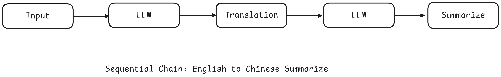
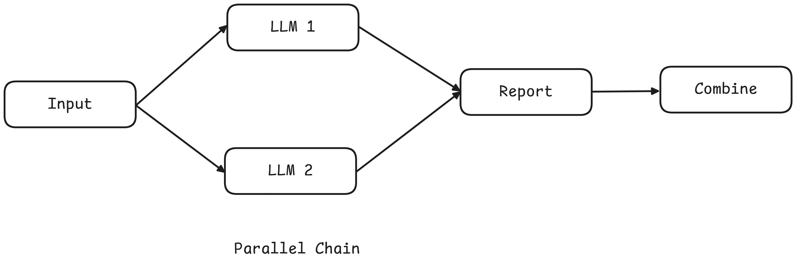
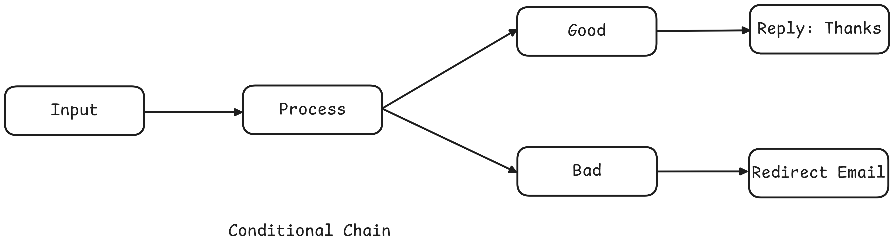
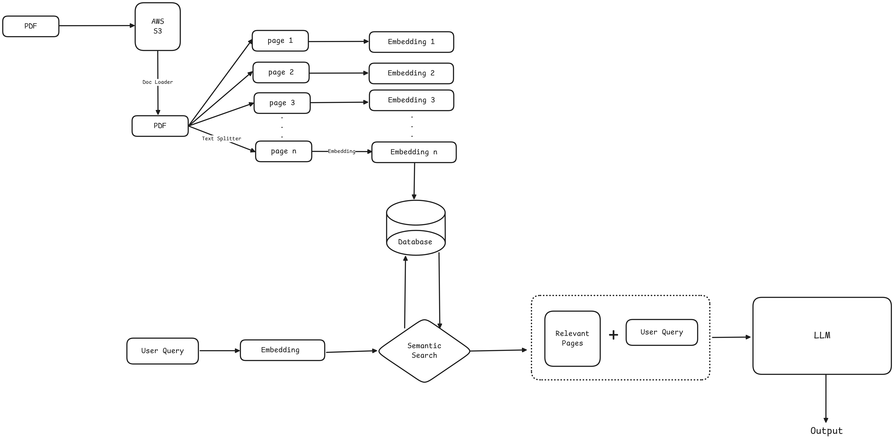

# **LangChain Components Overview**

LangChain provides a modular framework for building applications with large language models (LLMs). It includes six foundational components that help structure, manage, and scale AI-powered workflows.

---

## **1. Models**

Models are the core interface to LLMs and embeddings.

### **Key Challenges**
- Natural language understanding (NLU)
- Context-aware generation
- Local deployment limitations due to model size (often >100GB)

### **LangChain’s Approach**
- Standardized **Model Component Interface**
- Easy switching between providers like OpenAI, Anthropic, or Ollama via APIs

### **Supported Model Types**
| Type               | Input → Output         | Use Case                         |
|--------------------|------------------------|----------------------------------|
| **Language Models** | Text → Text            | General text generation          |
| **Embedding Models** | Text → Vector         | Semantic search, similarity matching |

---

## **2. Prompts**

Prompts control how LLMs behave by shaping the input structure.

### **Common Prompting Techniques**

- **Dynamic and Reusable Templates**
```python
from langchain.prompts import PromptTemplate
prompt = PromptTemplate.from_template("Summarize {topic} in a {tone} tone")
print(prompt.format(topic="cricket", tone="fun"))
```

- **Role-Based Prompts**
```python
from langchain.prompts import ChatPromptTemplate
chat_prompt = ChatPromptTemplate.from_messages([
    ("system", "You are an experienced {profession}"),
    ("user", "Tell me about {topic}")
])
formatted_messages = chat_prompt.format_messages(profession="Doctor", topic="headache")
```

- **Few-Shot Prompting**
```python
# Step 1: 
examples = [
    {"input": "I was charged twice for my subscription this month",  "output": "Billing"},
    {"input": "The App crashes everytime I try to log in.", "output": "Technical Support"},
    {"input":"Can you explain how to upgrade my plan?","output":"General Inquiry"},
    {"input":"I need a refund for a payment I didn't authorize","output":"Billing Issue"},
]

# Step 2: Create an example template
example_template = """
ticket: {input}
category: {output}

"""

# Step 3: build the few_shot_prompt template
few_shot_prompt = FewShotPromptTemplate(
    examples = examples,
    example_prompt = PromptTemplate(input_variables=["input","output"], template=example_template),
    prefix = "Classify the following customer support tickets into one of the categories: 'Billing', 'Issue', 'Technical Problem', or 'General Inquiry'" 
    suffix = "Ticket: {user_input} Category: ",
    input_varibles = ["user_input"]
)

```

---

## **3. Chains**

Chains enable the creation of multi-step pipelines using LLMs and tools.

### **Chain Types**
| Type            | Flow Description                       | Example                                  |
|------------------|----------------------------------------|------------------------------------------|
| **Sequential**    | Step-by-step                           | Translate → Summarize → Output           |
| **Parallel**      | Tasks in parallel                      | Analyze sentiment + Extract keywords     |
| **Conditional**   | Input-based routing                    | Route medical questions to Doctor agent  |

Chains reduce complexity by modularizing logic and allow easy reuse and scaling of workflows.





---

## **4. Indexes**

Indexes connect your application to external, unstructured data sources.

### **Core Components**
1. **Document Loaders** – Import content from PDFs, websites, databases
2. **Text Splitters** – Chunk large documents for LLM consumption
3. **Vector Stores** – Store vector embeddings for similarity search
4. **Retrievers** – Retrieve relevant chunks based on a query

*Example Use Case*: Upload manuals, split them into chunks, embed into a vector DB, and use semantic search to answer questions from users.


---

## **5. Memory**

LangChain adds memory to track interaction history—solving the stateless limitation of LLMs.

### **Why Memory Matters**
Without memory:
```
User: Zardari is Pakistan’s president, age 80  
Follow-up: How old is Zardari?  
LLM: I don’t know.
```
With memory, the LLM recalls earlier context.

### **Memory Types**
| Type                         | Description                             |
|------------------------------|-----------------------------------------|
| `ConversationBufferMemory`   | Stores full conversation history        |
| `ConversationBufferWindowMemory` | Retains last *k* messages             |
| `ConversationSummaryMemory` | Summarizes conversation for efficiency  |
| **Custom Memory**            | Build your own context tracking logic   |

---

## **6. Agents**

Agents are autonomous systems that reason, decide, and use tools dynamically.

### **Key Capabilities**
- **Tool usage** (e.g., search, calculator, database query)
- **Multi-step reasoning** (e.g., decompose and solve)
- **Dynamic workflows** (adjust steps based on the situation)

### **Example: Support Agent**
1. Detects issue type  
2. Searches a knowledge base  
3. Initiates refund or escalates  

Agents allow LLMs to behave like decision-making systems, not just passive responders.

---

## **Summary Table**

| Component   | Purpose                                  | Example Use Case                            |
|-------------|-------------------------------------------|----------------------------------------------|
| Models      | Generate or embed text                    | Answering queries, semantic similarity       |
| Prompts     | Format instructions for the model         | Summarization, classification                |
| Chains      | Multi-step workflows                      | Translate + summarize                        |
| Indexes     | Access to external knowledge              | Searching PDFs, websites                     |
| Memory      | Maintain context                          | Remember user preferences                    |
| Agents      | Enable reasoning + tool usage             | Dynamic customer support                     |

---
