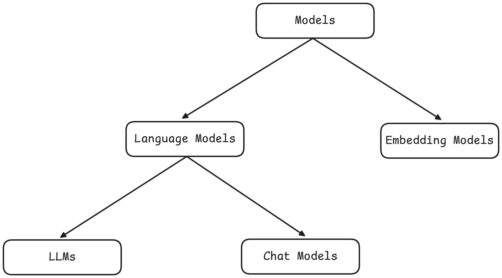
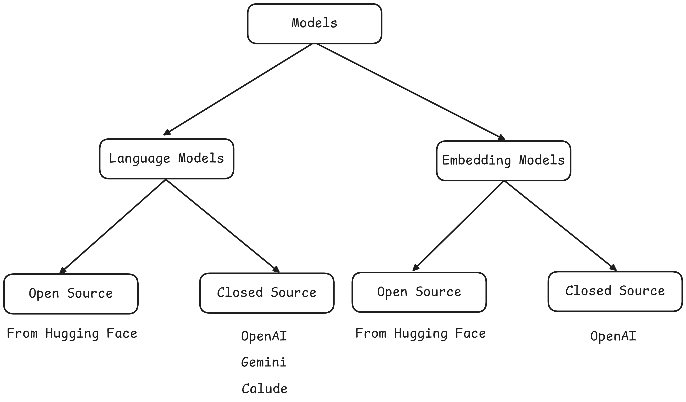

# Model Component

The Model Component in LangChain provides a standardized interface to interact with various AI models, making it easier to work across providers and model types. It abstracts away implementation details and enables developers to:

- Use different LLMs and embedding models through a unified API
- Build tools for text generation, semantic search, and dialogue systems
- Seamlessly switch between providers like OpenAI, Anthropic, and more







## Language Models Types
Language Models are AI Systems designed to process, generate, and understand natural language text.

### 1. Base Language Models (LLMs)
These are general-purpose models that take raw text as input and return text as output. They are stateless and designed for one-off tasks.
    - Stateless, single-turn interaction
    - Suitable for content transformation and batch tasks
    - No role or conversational context awareness

### 2.**Chat Models**:
Language models that are specialized for conversational tasks. They take a sequence of messages as input and returns chat messages as output (as opposed to using plain text). These are traditionally newer models and used more in comparision to the LLMs.


| Feature             | LLMs (Base Models)                                      | Chat Models (Instruction-Tuned)                                            |
|---------------------|---------------------------------------------------------|----------------------------------------------------------------------------|
| Purpose             | Free-form text generation                               | Optimized for multi-turn conversations                                     |
| Training Data       | General text corpora (books, articles)                  | Fine-tuned on chat datasets (dialogues, user-assistant conversations)      |
| Memory & Context    | No built-in memory                                      | Supports structured conversation history                                   |
| Role Awareness      | No understanding of roles like "user" or "assistant"    | Understands roles like "system", "user", and "assistant"                   |
| Example Models      | GPT-3, LLaMA-2-7B, OPT-1.3B                              | GPT-4, GPT-3.5 Turbo, LLaMA-2-Chat, Mistral-Instruct, Claude               |
| Use Cases           | Text generation, summarization, translation, code gen   | Conversational AI, chatbots, virtual assistants, customer support, AI tutors |


### Setting up Env: Using `pip` (Traditional)

1. **Create a new project folder**

2. **Open the folder in VS Code**

3. **Create a virtual environment**

   ```bash
   python -m venv venv
   ```

4. **Activate the virtual environment**
   On PowerShell:

   ```bash
   .\venv\Scripts\Activate
   ```

5. **(Optional) If you encounter an execution policy error**, run:

   ```bash
   Set-ExecutionPolicy RemoteSigned -Scope Process
   ```

6. **Create a `requirements.txt` file** and add the necessary dependencies:

```py
    # LangChain Core
    langchain
    langchain-core

    # OpenAI Integration
    langchain-openai
    openai

    # Anthropic Integration
    langchain-anthropic

    # Google Gemini (PaLM) Integration
    langchain-google-genai
    google-generativeai

    # Hugging Face Integration
    langchain-huggingface
    transformers
    huggingface-hub

    # Environment Variable Management
    python-dotenv

    # Machine Learning Utilities
    numpy
    scikit-learn
```

7. **Install the packages**

   ```bash
   pip install -r requirements.txt
   ```

8. **Verify the installation**

   ```python
   import langchain
   print(langchain.__version__)
   ```


### With uv package manager

```py
pip install uv
uv venv venv 
```

### For later use | init project
```py
uv init porject_name
cd project_name
uv run main.py
uv add pandas
uv build
```