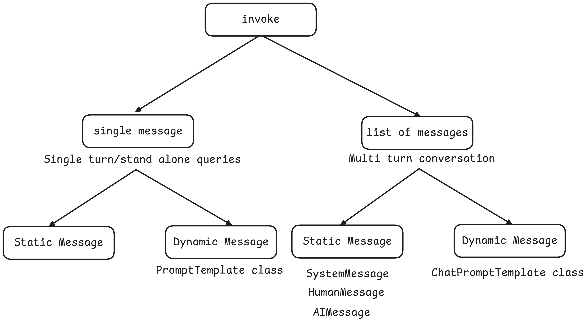

# Prompts
Prompts are the input instructions or queries given to a model to guide its output.


- **Static vs Dynamic Prompts**

| Feature     | Static Prompts                         | Dynamic Prompts                                         |
| ----------- | -------------------------------------- | ------------------------------------------------------- |
| Definition  | Fixed text used directly in the prompt | Prompt content is generated or modified at runtime      |
| Flexibility | Not adaptable to input changes         | Adapts based on variables, context, or user input       |
| Use Case    | Simple, repeatable tasks               | Complex or personalized tasks                           |
| Example     | `"Translate this text to French:"`     | `f"Translate this to French: {user_input}"`             |
| Tools Used  | Plain strings                          | String formatting, f-strings, LangChain PromptTemplates |

Use static prompts for fixed instructions. Use dynamic prompts when prompts need to change based on context or input.

## Prompt Template
A Prompt Template in LangChain is a structured way to create prompts dynamically by inserting variables into a predefined template. Instead of `hardcoding prompts`, PromptTemplate allows you to defined palceholders that can be filled in runtime with different inputs.

This makes it resusable, flexible, and easy to manage, especially when working with dynamic user inputs or automated workflows(chains/pipelines).

### Why use Prompt Template over f strings?
1. Defualt validation 
    - `validation_template=True`
2. Reusable
    - `template.json`
3. LangChain Ecosystem
    - `chains`


## Messages

- **Problem**: If you pass the entire chat history as a simple list to a model, it's hard for the LLM to differentiate between ai responses and user inputs, particularly as the conversation lengthens. It's preferable to format the history using dictionaries with clear user and ai keys for every message. Luckily, LangChain comes with a pre-existing module named messages that automatically formats this for you.

```py
from langchain_google_genai.chat_models import ChatGoogleGenerativeAI
from dotenv import load_dotenv

load_dotenv()

model = ChatGoogleGenerativeAI(model="gemini-1.5-pro")

while True:
    user_input = input("You: ")
    if user_input == "exit":
        break 
    result = model.invoke(user_input) # send the static prompt
    print("AI: ", result.content)

# Example:
# You: which one is bigger 3 or 7
# AI:  7 is bigger than 3.
# You: multiply bigger number with 10 and give me the result
# AI:  Please provide the bigger number.  I need a number to multiply by 10.
```

### Types of Messages in LangChain
1. SystemMessage
Used to set context, rules, or behavior for the model.
    - **Example**: "You are a helpful assistant."

2. HumanMessage
    - Represents input from the user.
    - This is what the user says or asks.

3. AIMessage
    - Represents responses generated by the model (AI).


## Chat Prompt Templates



## Message Placeholder
A MessagePlaceholder in LangChain is a special placeholder used inside a ChatPromptTemplate to dynamically insert chat history of a list of messages at runtime.


