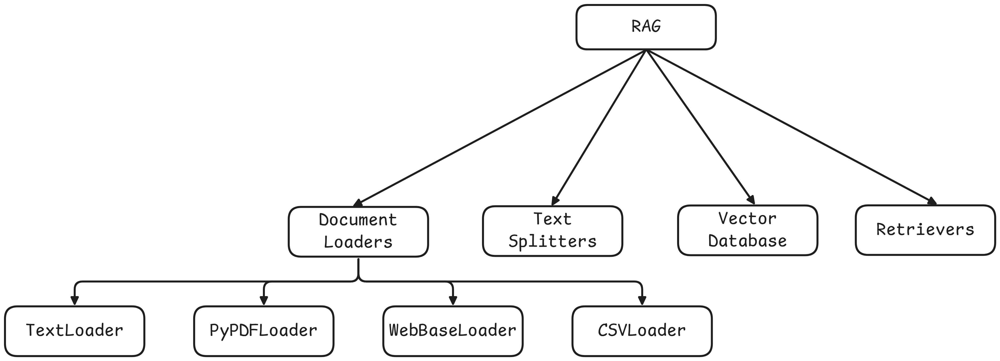

# Document Loaders
Document loaders are components in LangChain used to load data from various sources into a standardized format (usually as Document object), which can then be used for chunking. 

```bash
page_content = "The actual text content",
meta_data = {"source":"filename.pdf",...}
```



We will be dicussing the 4 most common document loaders also mentioned in the Figure above. 


## 1. TextLoader
TextLoader is a simple and commonly used document loader in LangChain that reads plain text(.txt) files and converts them into LangChain Document Objects.

Use case
- Ideal for loading chat logs, scraped text, transcripts, code snippets, or any plain text data into a LangChain pipeline.

- Limitation
Works only with .txt files


## 2. PyPDFLoader
PyPDFLoader is a document loader in LangChain used to load context from PDF files and convert each page into a Document object. 

```bash
[
    Document(page_content="Text from page 1", meta_data={"page":0,"srouce":"file.pdf"})
    Document(page_content="Text from page 2", meta_data={"page":1,"srouce":"file.pdf"})
]
```

- Limitations 
It uses the PyPDF library under the hood that's not suitable for scanned PDFs or complex layouts. There are some other PDF loaders available in langchain to tackle with this.

|       Use Case            | Recommended Loader            |
|---------------------------|-------------------------------|
|Simple Clean PDFs          | PyPDF Loader                  |
|PDFs with tables/columns   | PDFPlumberLoader              |
|Scanned/Images PDF         | UnstructuredPDFLoader, AmazomTextExtractorPDFLoader|
|Need layout and image data | PyMuPDFLoader                 |
|Want best structure extraction|UnstructuredPDFLoader       |

[Click Here to read more on LangChain Document Loader ](https://python.langchain.com/docs/concepts/document_loaders/)

## 3. DirectoryLoader
DirectoryLoader is a document loader that lets you load multiple documents from a directory of files.

| Global Pattern    | What is loads     |
|-------------------|-------------------|
| `**/*.txt`        |All .txt files in all subfolders|
|   `*.pdf`         |All .pdf files in the root directory|
|   `data/*.csv`    |All .csv files in the `data/` folder|
|   `**/*`          |All files (any type, all folders)   |


You will notice that loading a directory with 2-3 pdf files with overall around 1000 pages takes between 10 to 20 seconds and what if there are a 100 pdf? To process them you need to load all the PDFs in the RAM that will be time consuming and computational costly. Thankfully LangChain provide a solution to deal with it.

## Load vs Lazy Load
Usually we were using the `.load()` method to load the files but there is also another predefined method `.lazy_load()`. 

### load()
- Eager loading (loads everything at once)
- Returns: A list of Document objects
- Loads all documents immediately into memory.


## 4. WebBaseLoader
WebBaseLoader is a document loader in LangChain used to load and exract text content from web page (URLs).

It uses beautifulsoup under the hood to parse HTML and extract visible text.

- **When to use**
For blogs, news articles, or public websites where the content is primarily text based and static.

- **Limitations**
    - Doesn't handle javascript-heavy pages well (use SeleniumURLLoader for that).
    - Loads only static content (what's in the HTML, not what loads after the page renders).

## 5. CSVLoader
CSVLoader is a document loader used to load CSV files into LangChain Document objects, one per row by default.  
