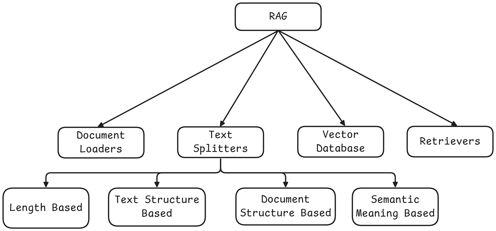

# TextSplitters
Text splitting is the process of breaking large chunks of text (like articles, PDFs, HTML Pages, or books) into smaller, manageable pieces (chunks) that an LLM can handle effectively. 

- **Overcoming model limitation**: Many embedding models and language models that have maximum input size constraints. Splitting allows us to process documents, otherwise exceed these limits. 

- **Downstream tasks**: Text splitting improves nearly every LLM powered task

| Task | Why Splitting Helps |
|------|---------------------|
|Embedding | Sort chunks yield more accurate vectors|
|Semantic Serach | Search results point to focused info not noise|
|Summarization| Prevents hallucination and topic drift |

- **Optimizing computational resources**: Working with smaller chunks of text can be more memory-efficient and allow for better parallelization of processing tasks. 

## 1. Length Based

## 2. Text Structure Based
    - `\n\n`: Paragraph
    - `\n`: line
    - `_`: word
    - `""`: character 