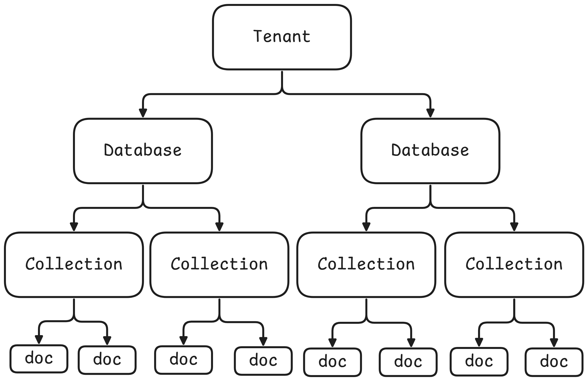

# Vector
A vector store is a system desgined to store and retrieve data represented as numerical vectors. 

- **Characterisitcs**:
    - `Storage`: Ensures vectors and their associated metadata are retained, whether `in-memory` for quick lookups or `on-disk` for durability and large-scale use.
    - `Similarity Search`: Helps retrieve the vectors most similar to a query vector.
    - `Indexing`: Provide a data structure or method enables fast similarity searches on high-dimensional vectors (e.g., approximate nearest neighbor lookups).
    - `CRUD Operations`: Manage the lifecycle of data, adding new vectors, reading them, updating existing entries, removing outdated vectors.

- **Use Cases**:
    - Semantic Search
    - RAG
    - Recommender Systems
    - Image/Multimedia search


## Vector Store vs. Vector Database

### Vector Store

- Typically refers to a lightweight library or service that focuses on storing vectors (embeddings) and performing similarity search.

- May not include many traditional database features like transactions, rich query languages, or role-based access control.

- Ideal for prototyping, smaller-scale applications. 

- Examples: FAISS (where you store vectors and can query them by similarity, but you handle presistence and scaling seperately)

### Vector Database
A full-fledged database system designed to store and query vectors.

- Offers additional `database-like` features.
    - Distributed architecture for horizontal scaling
    - Durability and presistence (replication, backup/restore)
    - Metadata handling (schemas, filters)
    - Potential for ACID or near-ACID guarantees
    - Authentication/Authoriczation and more advanced security

Geared for production environments with significant scaling, large datasets.
- Ex: Milvus, Qdrant, Weaviate, Pinecone

A vector database is effectively a vector store with extra database features (e.g., clustering, scaling, security, metadata filtering, and durability)

## Vector Stores in LangChain
- Supported Stores: LangChain integrates with multiple vector stores (FAISS, Pinecone, Chroma, Qdrant, etc), giving you flexibility in scale, features, and deployment.

- Common interface: A uniform vector store API lets you swap out one backend (e.g., FAISS) for another (e.g., Pinecone) with minimal code changes.

```py
from_documents(...) or from_texts(...)
add_documents(...) or add_texts(...)
similarity_search(query, k=...)
```


- Metadata handling: Most vector stores in LangChain allow you to attach metadata (e.g., timestamps, authors) to each document, enabling filter-based retrieval.


## Chroma
Chroma is a lightweight, open-source vector database that is especially friendly for local development and small scalre to medium scale production. 



### Exercises

1. Create LangChain documents
2. add documents
3. view documents
4. search documents
5. search with similarity score
6. meta-data filtering
7. update documents & view documents
8. delete document & view documents

